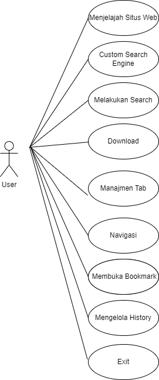
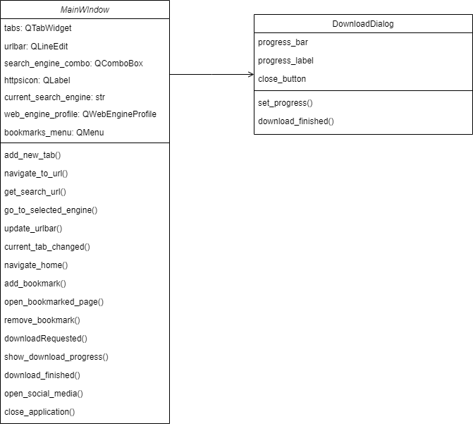
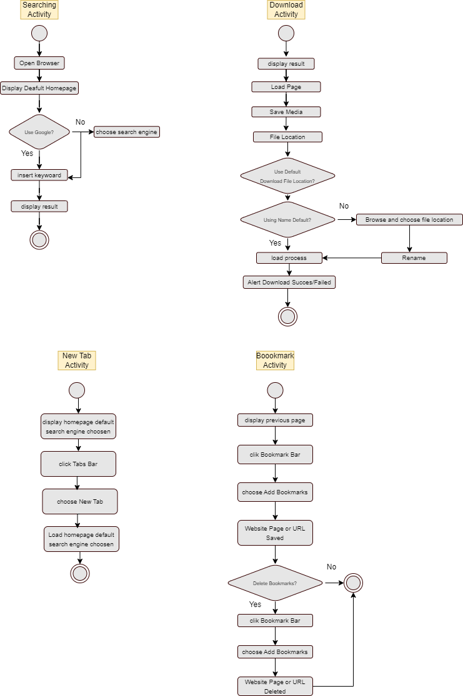
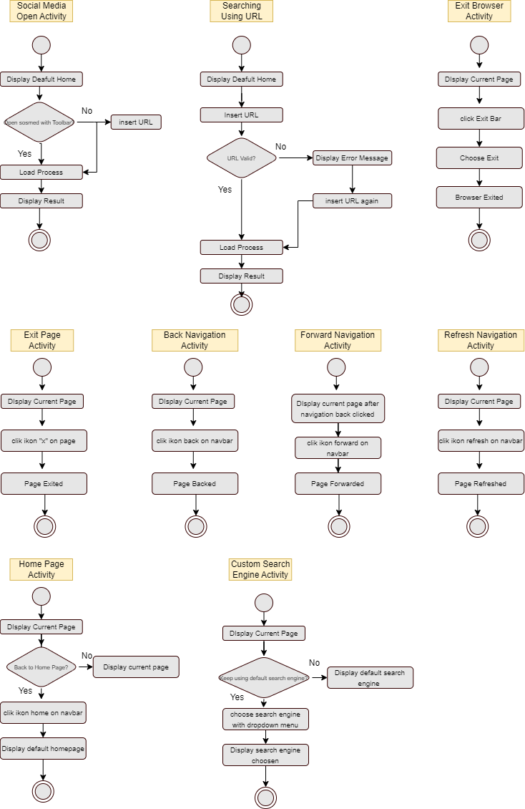
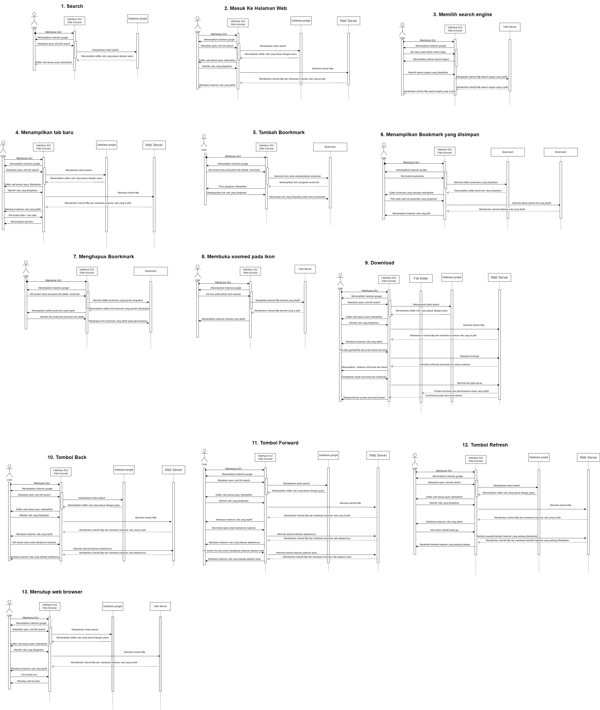

# Web Browser App
## Kelompok 1
1. Irfan Adi Prayogo             (5302422005)
2. Fara Raisha Septiana          (5302422007)
3. Hana Aeni Mustahibah          (5302422011)
4. Afriani Fajar Navissaturrisqi (5302422021)

### Features
1. Menu Bar
   a. Tabs
      - New Tab 
   b. Menu
      - Add Bookmark
      - Delete Bookmark
   c. Bookmarks
      - Menyimpan alamat dan situs Website yang pernah dikunjungi
   d. Exit

2. Social Media Toolbar
   Berisi mengenai icon social media, dimana ketika diklik akan menampilkan website social media tersebut. Social Media yang tercantum yakni:
     a. Gmail
     b. Tiktok
     c. Youtube
     d. Instagram
     e. Facebook
     f. WhatsApp
     g. Twitter
     
4. Navigation Bar
   a. Back
   b. Forward
   c. Reload (Refresh)
   d. Home Page
   
5. Custom Search Engine
   Terdapat menu dropdown yang digunakan untuk memilih seacrh engine sesuai dengan keinginan. Search Engine pada menu dropdown yakni:
   a. Google
   b. Bing
   c. DuckDuckGo
   d. Yahoo
   e. AOL
   f. Baidu
   g. Looksmart
   h. ASK
   i. Ecosia
    
6. Exit
   
### Use Case Diagram

### Class Diagram

### Activity Diagram

### Sequence Diagram

### Kode Program
[klik disini untuk melihat code](WE_OPER.py)

